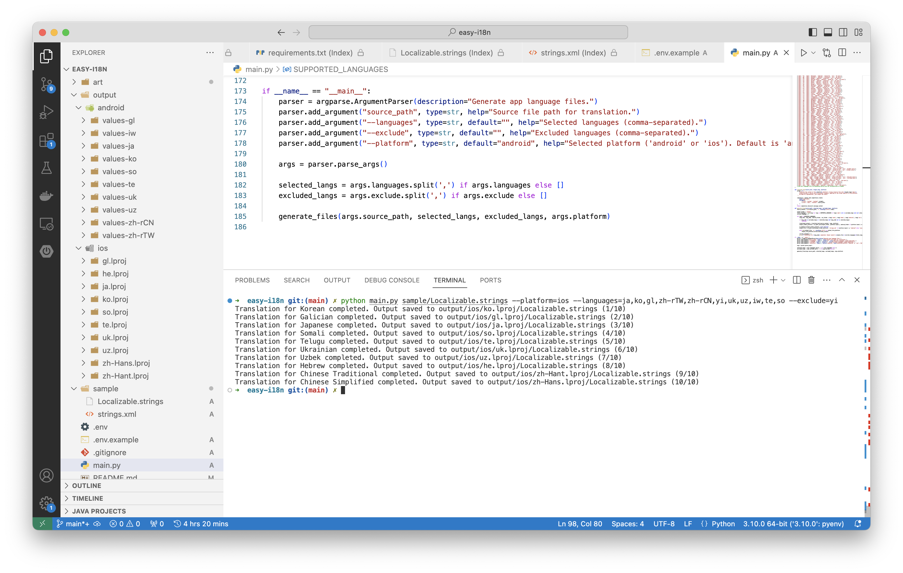

# Easy-i18n

Easy-i18n is a tool designed to generate multilingual files for Android and iOS platforms using OpenAI's GPT language model.

## Usage

### Installation

Clone the repository and navigate to the project folder:

```bash
git clone https://github.com/carlislechan/easy-i18n.git
cd easy-i18n
```

Copy the .env.example file to create a new .env file:

```bash
cp .env.example .env
```

Edit the .env file and fill in your OpenAI API key:

```bash
OPENAI_BASE_URL=https://api.openai.com/v1/  # Optional
OPENAI_API_KEY=your-api-key-here
OPENAI_MODEL=gpt-4-32k  # Optional
```

Install the required dependencies:

```bash
pip install -r requirements.txt
```

### Running the Example

To generate multilingual files for a sample source file, use the following command:

```bash
python main.py path/to/source/file.txt
```

Replace `path/to/source/file.txt` with the path to your source file.

The generated files will be saved in the `output` folder, organized by **platform** and **language**.

### Parameters

- `path/to/source/file.txt`: Path to the source file for translation.
- `--platform`: Specify the platform ('android' or 'ios'). Default is 'android'.
- `--languages`: List of selected languages (comma-separated).
- `--exclude`: List of excluded languages (comma-separated).

### Supported Languages

Easy-i18n supports the following languages:

- English (en)
- Chinese (Simplified) (zh-CN)
- Spanish (es)
- German (de)
- French (fr)
- Russian (ru)
- Japanese (ja)
- Korean (ko)
- Portuguese (pt)
- Italian (it)

... and many more (total 116 languages).

For a complete list of supported languages, refer to the `SUPPORTED_LANGUAGES` section in the script.

### Example Output



Enjoy it 🍺


**All code in this project was written by ChatGPT.**
